1. **Clone the repository**

   ```bash
   git clone https://github.com/neamat205/MinAccApp.git
   cd MinAccApp

2. **🔧 Set Up the Database**
🛠️ Identity Table Migration (EF Core)
This project uses ASP.NET Core Identity for authentication and user role management.
Identity-related tables such as:
• AspNetUsers, AspNetRoles, AspNetUserRoles, AspNetUserClaims
• AspNetUserLogins, AspNetUserTokens, AspNetRoleClaims
are generated automatically by running the following EF Core migration commands:

```bash 
dotnet ef migrations add InitialIdentitySetup
dotnet ef database update
```

🧱 Manual SQL Setup
1. Open SQL Server Management Studio (SSMS)
2. Create a new database (e.g., MinAccDB)
3. Execute .sql files manually from the Database/ directory:

```text 
📁 Database/
  ├── Tables.sql               # Create application tables
  ├── UserDefinedTypes.sql     # Define custom table types
  ├── StoredProcedures.sql     # Create stored procedures
```
3. ▶️ Run the application

```bash dotnet restore
dotnet run
```

4. **🔐 Authentication & Authorization**
➕ ASP.NET Core Identity Integration

Uses default Identity tables:
• AspNetUsers, AspNetRoles, AspNetUserRoles, AspNetUserClaims, AspNetUserRoleClaims
• Enables secure user authentication and role assignment.
➡️ Custom Role-Based Access (No [Authorize(...)])

Not using [Authorize(Roles = "...")] attribute.
• Permission enforcement is handled manually at the page level.
• Controlled via stored procedures:
    ◦ sp_GetPermissionsForUserAndModule
    ◦ sp_SetPermissionForRole
    ◦ sp_AssignRoleToUser
    ◦ sp_GetPermissionByRole


5. **📊 Excel Report Generation**

### Overview

The application supports exporting data as Excel reports for easy sharing and analysis.

### Key Features

- Export data like vouchers, chart of accounts, and user information
- Generates `.xlsx` files compatible with Microsoft Excel and other spreadsheet software
- Produces well-formatted, readable reports
- Efficiently handles large datasets

### How to Use

1. Navigate to the relevant data page (e.g., Voucher List, Chart of Accounts).
2. Click the **Export to Excel** button.
3. The Excel report is generated and downloaded automatically.

### Implementation

- Built using the [EPPlus](https://github.com/EPPlusSoftware/EPPlus) library for Excel file creation and manipulation
- Integrated within the .NET Core backend for smooth operation


## Screenshots

### ➕ Add Voucher

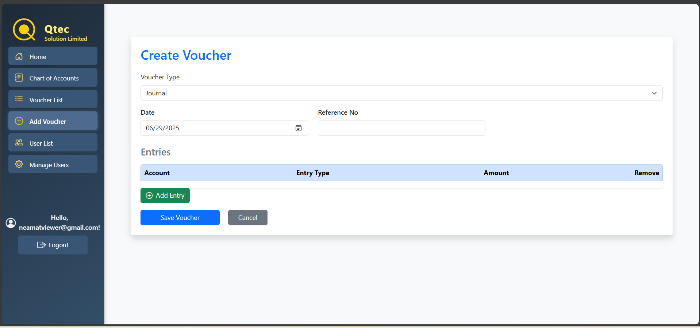

### 💵 Voucher List

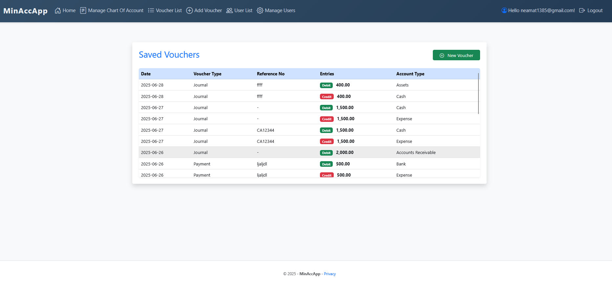

### 🏠 Home Page

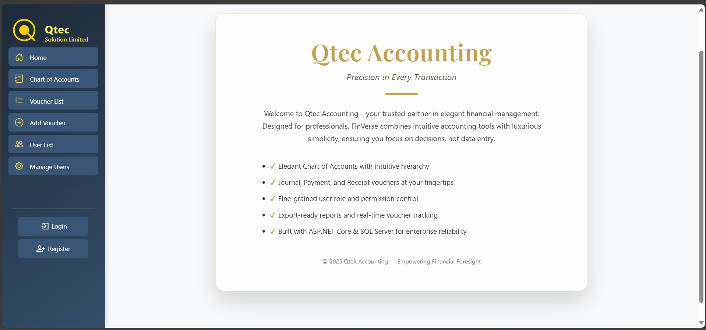

### 🔐 Login Page

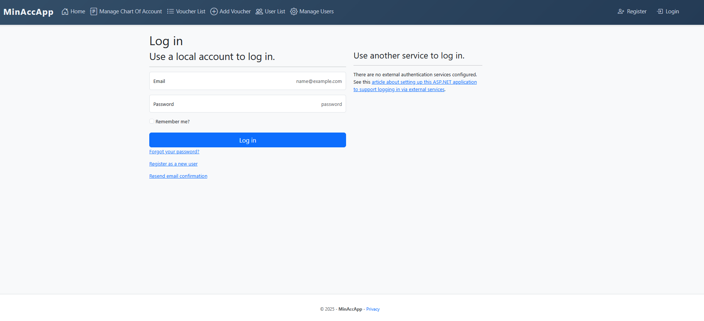

### 📊 Chart of Accounts

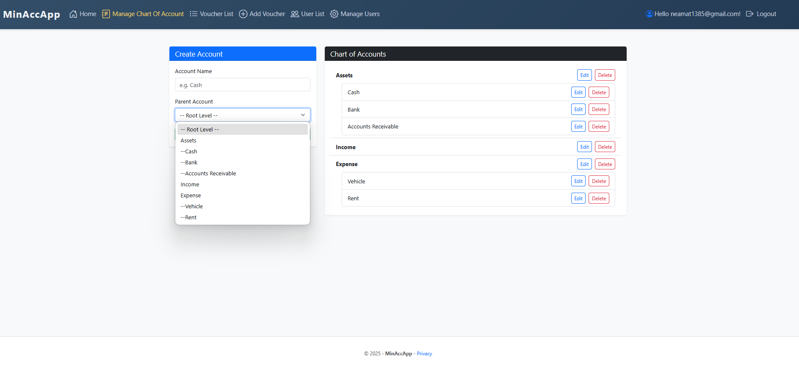

### 🔐 Registration Page

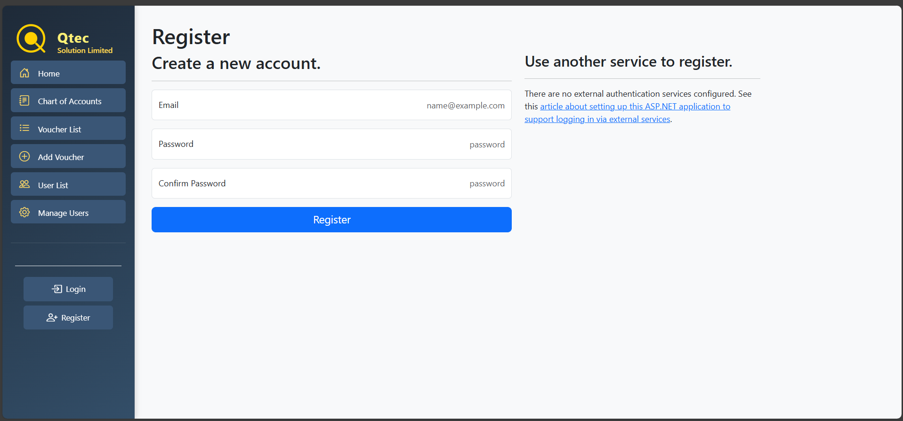

### 🧑‍💼 User Management

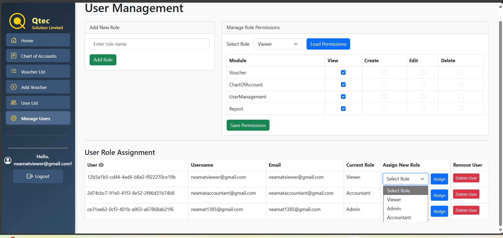

### 🧑‍💼 Voucher Report in Excell Form

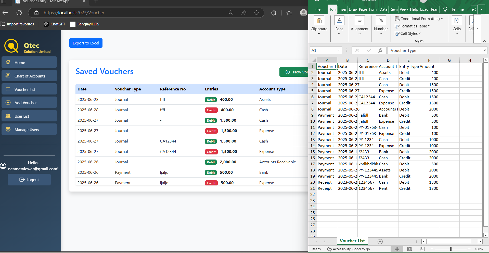


## Responsiveness

### 🖥️ Desktop Version
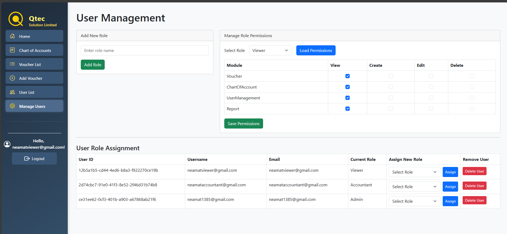

### 📱 Mobile Version
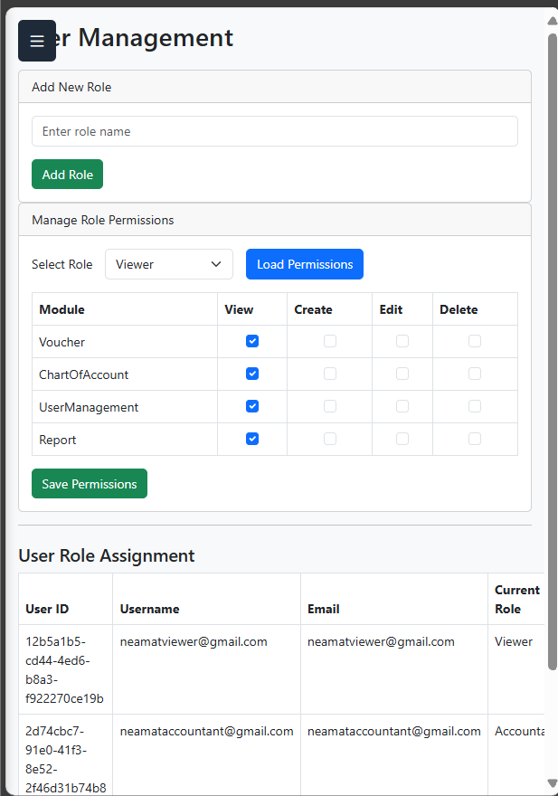

### 📋 With Navbar
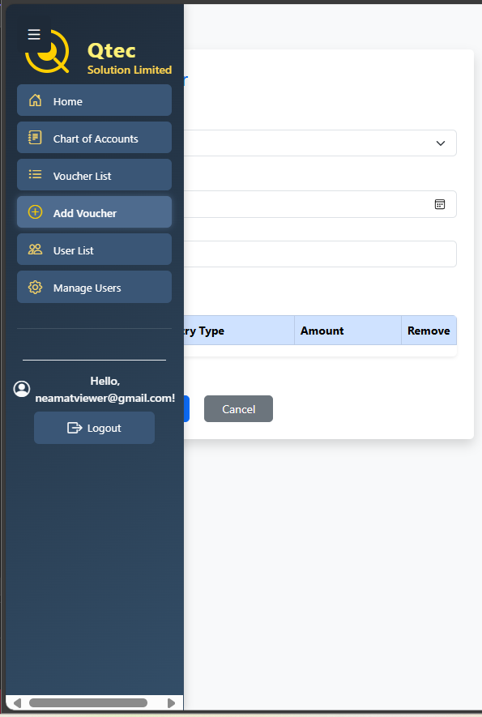
