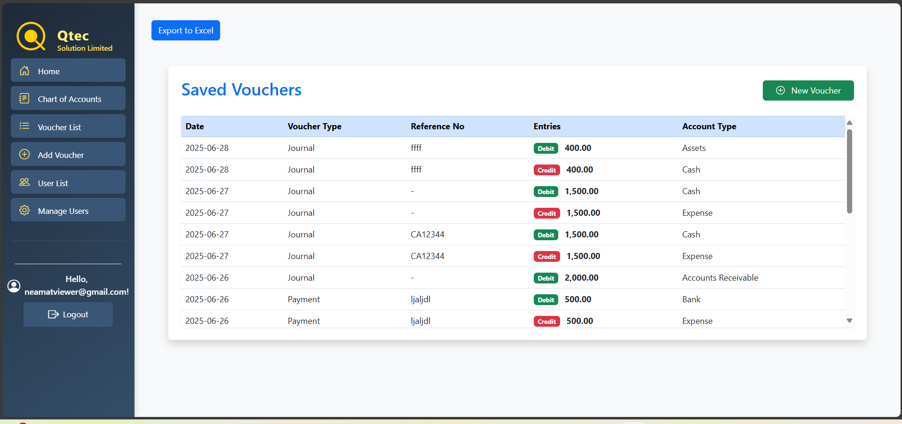
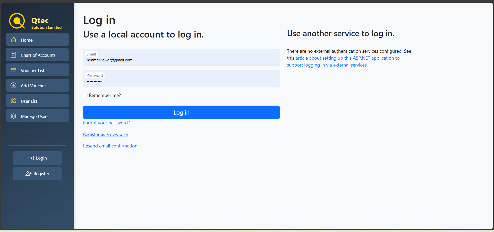
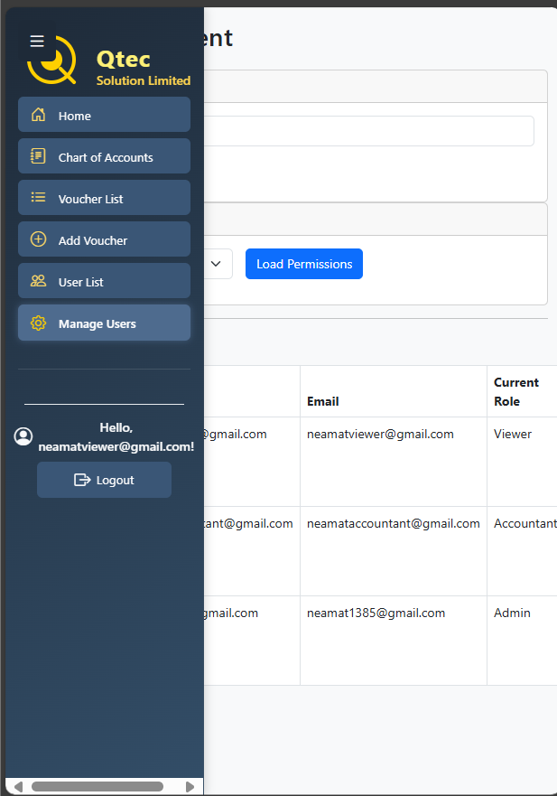

## 🚀 Getting Started

1. **Clone the repository**

   ```bash
   git clone https://github.com/neamat205/MinAccApp.git
   cd MinAccApp
   ```

## 2. 🔧 Set Up the Database

### 🛠️ Identity Table Migration (EF Core)

This project uses **ASP.NET Core Identity** for authentication and user role management.

Identity-related tables such as:

- `AspNetUsers`, `AspNetRoles`, `AspNetUserRoles`, `AspNetUserClaims`
- `AspNetUserLogins`, `AspNetUserTokens`, `AspNetRoleClaims`

are generated automatically by running the following EF Core migration commands:

````bash
dotnet ef migrations add InitialIdentitySetup
dotnet ef database update

### 🧱 Manual SQL Setup

1. Open **SQL Server Management Studio (SSMS)**
2. Create a new database (e.g., `MinAccDB`)
3. Execute `.sql` files manually from the `Database/` directory:

```text
📁 Database/
  ├── Tables.sql               # Create application tables
  ├── UserDefinedTypes.sql     # Define custom table types
  ├── StoredProcedures.sql     # Create stored procedures


4. **Run the application**
   - In Visual Studio: Press F5
   - Or CLI:
     ```bash
     dotnet restore
     dotnet run
     ```

---
4. 🔐**Authentication & Authorization**

➕ ASP.NET Core Identity Integration
Uses default Identity tables:

   - AspNetUsers, AspNetRoles, AspNetUserRoles, AspNetUserClaims, AspNetUserRoleClaims

   - Enables secure user authentication and role assignment.

➡️ Custom Role-Based Access (No [Authorize(...)])
Not using [Authorize(Roles = "...")] attribute.

   - Permission enforcement is handled manually at the page level.

   - Controlled via stored procedures:

      - sp_GetPermissionsForUserAndModule

      - sp_SetPermissionForRole

      - sp_AssignRoleToUser

      - sp_GetPermissionByRole


## Screenshots

### ➕ Add Voucher


### 💵 Voucher List



### 🏠 Home Page


### 🔐 Login Page



### 📊 Chart of Accounts


### 🔐 Registration Page


### 🧑‍💼 User Management


## Responsiveness

### 🖥️ Desktop Version


### 📱 Mobile Version


### 📋 With Navbar

````
