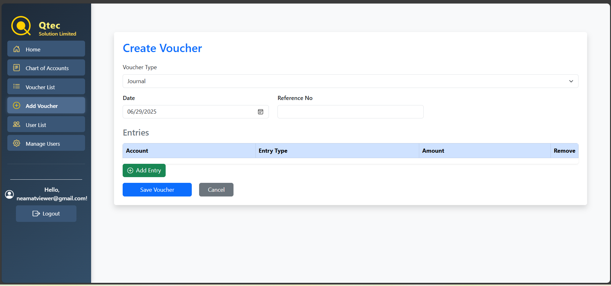
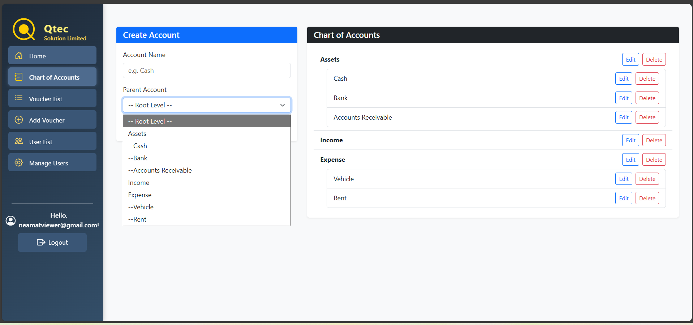
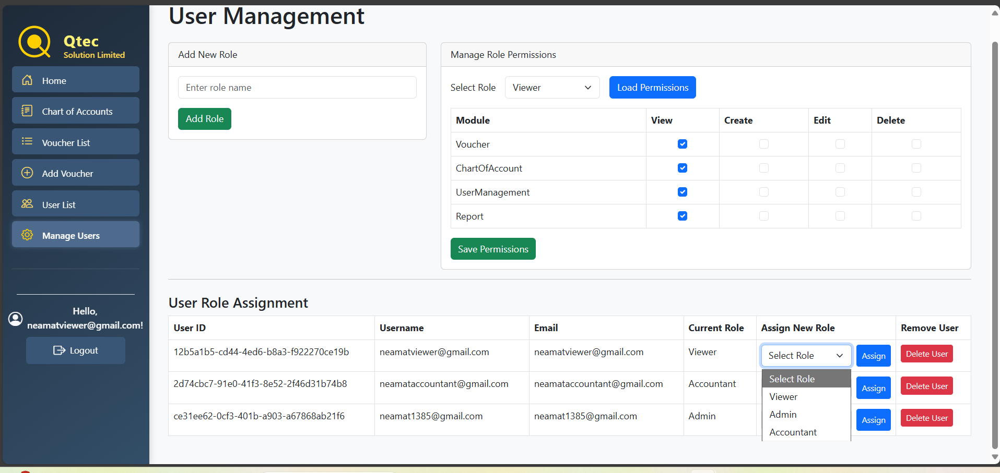

## 🚀 Getting Started

1. **Clone the repository**

   ```bash
   git clone https://github.com/neamat205/MinAccApp.git
   cd MinAccApp
   ```

2. **Set up the database**

   - Open SQL Server Management Studio
   - Create a new database (e.g., `MinAccDB`)
   - Run all `.sql` files from the `Database/` folder (tables first,then user defined types, then stored procedures)

3. **Configure `appsettings.json`**

   - Add Connection String As Your Hosted DB

   ```json
   "ConnectionStrings": {
     "DefaultConnection": ""
   }
   ```

4. **Run the application**
   - In Visual Studio: Press F5
   - Or CLI:
     ```bash
     dotnet restore
     dotnet run
     ```

---

## Screenshots

### ➕ Add Voucher



### 💵 Voucher List


### 🏠 Home Page


### 🔐 Login Page


### 📊 Chart of Accounts



### 🔐 Registration Page


### 🧑‍💼 User Management


